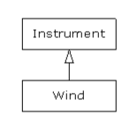

---
tags:
  - Java
slug: /thinking-in-java/inheritance
sidebar_position: 2
description: Java 繼承與 protected 關鍵字解析：確保程式碼安全性與靈活性
keywords:
  - java
  - Java程式設計
  - Java 繼承
  - Java protected 關鍵字
  - Java 向上轉型
  - Java 封裝
---
## 繼承與 `protected` 關鍵字
- 在現實情況中，我們經常希望某些事物盡可能對外部世界隱藏，但仍然允許衍生類別的成員訪問，這便是 **`protected`** 關鍵字的作用
    - **`protected`** 表明：對類別使用者來說這是 **`private`** 的，但對於繼承此類別的衍生類別或同一個 **`package`** 的類別來說卻是可以訪問的（**`protected`** 提供 package 內訪問權限）
- 儘管可以創建 `protected` 的欄位，最好還是盡量將欄位保持在 `private`，這樣應該一直保留**更改底層實作**的權利
```java
class Villain {
  private String name;
  protected void set(String nm) { name = nm; }
  public Villain(String name) { this.name = name; }
  public String toString() {
    return "I'm a Villain and my name is " + name;
  }
}	

public class Orc extends Villain {
  private int orcNumber;
  public Orc(String name, int orcNumber) {
    super(name);
    this.orcNumber = orcNumber;
  }
  public void change(String name, int orcNumber) {
    set(name); // Available because it's protected
    this.orcNumber = orcNumber;
  }
  public String toString() {
    return "Orc " + orcNumber + ": " + super.toString();
  }	
  public static void main(String[] args) {
    Orc orc = new Orc("Limburger", 12);
    print(orc);
    orc.change("Bob", 19);
    print(orc);
  }
} /* Output:
Orc 12: I'm a Villain and my name is Limburger
Orc 19: I'm a Villain and my name is Bob
*/
```
- 可以發現 `change()` 可以訪問 `set()`，因為它是 `protected`
- `Orc` 的 `toString()` 方法是根據基礎類別的版本而定義的
## 向上轉型 (Upcasting)
- 在繼承關係中，為新類別提供方法並非最重要的面向，最重要的是表明新類別是**現有類別的一種類型**
- 繼承可以確保向基礎類別發送的訊息對衍生類別同樣有效
```java
class Instrument {
  public void play() {}
  static void tune(Instrument i) {
    // ...
    i.play();
  }
}

// Wind objects are instruments
// because they have the same interface:
public class Wind extends Instrument {
  public static void main(String[] args) {
    Wind flute = new Wind();
    Instrument.tune(flute); // Upcasting
  }
}
```

- 在此處，`tune()` 可以接受 `Instrument` 的引用，可以由此認知到 `Wind` 物件同樣也是一種 `Instrument` 物件
- 這種轉換動作稱之為**向上轉型（Upcasting）**
### 為什麼稱為向上轉型



- 以傳統的類別繼承圖為基礎，將根（root）放置於頁面頂端並逐漸向下
- 由衍生類別轉換為基礎類別，在圖上是向上移動的，因此一般稱為**向上轉型**
- 向上轉型是由較專用的類型向通用類型轉換，所以總是很安全，也就是說，衍生類別是基礎類別的超集（superset），它可能含有更多方法，但至少需要具備基礎類別的所有方法
- 向上轉型唯一可能發生的情況是丟失方法，而非獲取方法，所以編譯器在“未曾明確表示轉型”或“未曾指定特殊標記”的情況下仍然允許向上轉型